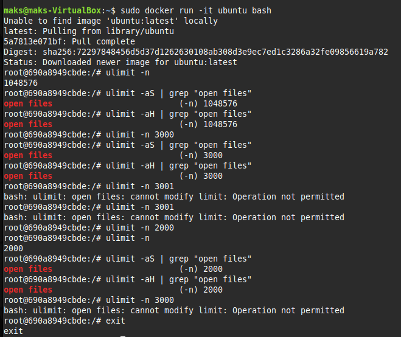
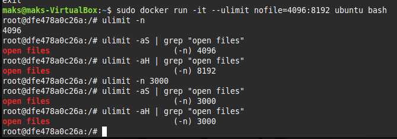
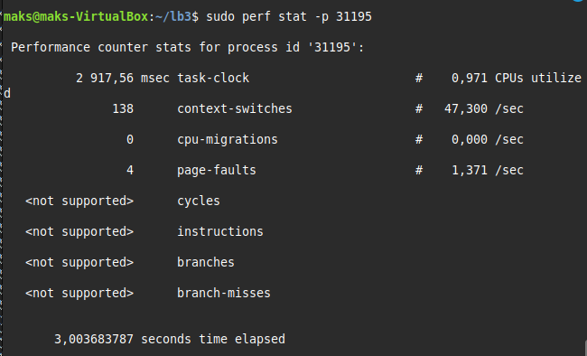
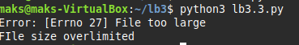
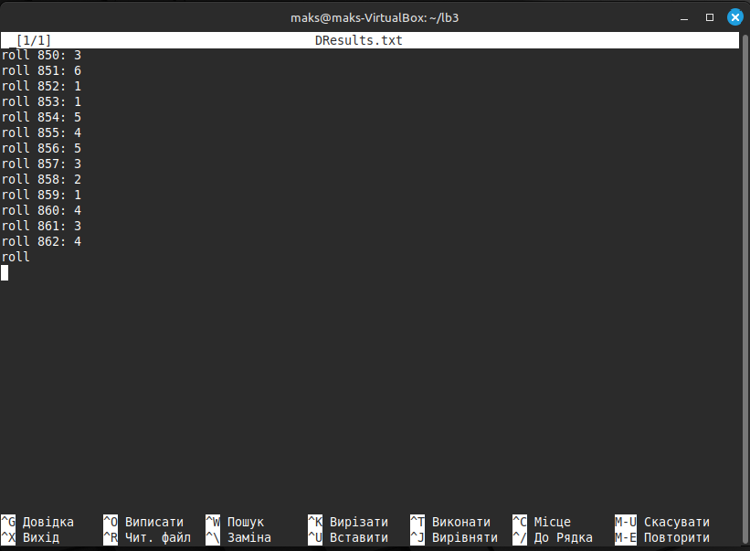
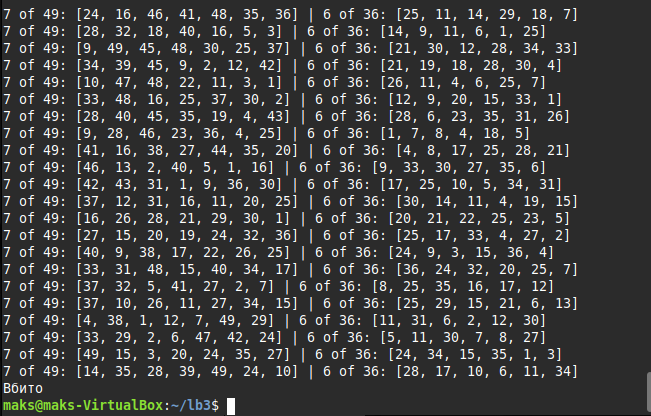
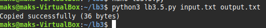
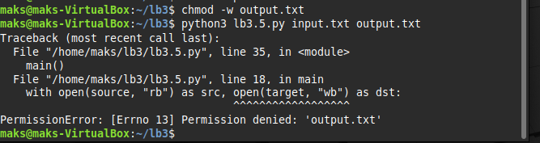
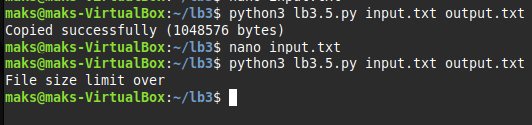
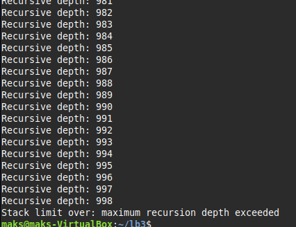

#  Лабораторна робота 3:

## 3.1

В першому завданні ми маємо протестувати різні команди пов'язані з різними обмеженнями відкритих файлів. 



Після того, як написав усі ці команди потрібно авторизуватися з root-правами: 
```bash
bash docker run -it --ulimit nofile=4096:8192 ubuntu bash
```



Можна побачити, що ліміт у всіх -aH (hard limit) файлів став більшим за -aS (soft limit)

---

## 3.2

Потрібно встановити perf у Docker-контейнері. Це робиться через ```privileged```  в контейнері:
```bash
bash docker run -it --privileged ubuntu bash
```

Після цього можна встановлювати ```perf```:
```bash
bash apt update && apt install -y linux-tools-common linux-tools-generic linux-tools-$(uname -r)
```

Маємо невеличку програму на 'С' з незкінечним лупом:
[lb3.2.c](lb3.2.c)

В іншому вікні терміналу вводимо
```bash
bash ps aux
```

Відслідковуємо PID запущеної програму і вводимо
```bash
bash perf stat -p <PID>
```



---

##  3.3

Маємо програму для [кидків](lb3.3.py) кубика на пайтоні та текстовий документ, куди записуються [результати](DResults.txt):

Перед тим, як її запустити встановлюю обмеження 10 блоків по 512 байт:
```bash
bash ulimit -f 10
```

Запускаю:
```bash
bash python3 dice_simulator.p
```

Вивело таку помилку в консолі:



Програма перевищела ліміт на цьому моменті:



Усередині контейнера:
```bash
apt update && apt install -y python3 gcc make perf gdb
```

---

##  3.4

Маємо програму яка імітує [лотерею](lb3.4.py)

Перед запуском встановлюю ліміт на 2 секунди:
```bash
bash ulimit -t 2
```

Після запуску програма почне виводити в консоль результати кидків і ядро силоміць знищує програму після вичерпання ліміту процесу:



Ядро вбиває процес, після чого ми бачимо у консолі слово "Вбито"(Killed) яке спричиняє саме ядро.

---

##  3.5

Створюємо програму для [копіювання](lb3.5.py) вмісту текста. Вона приймає 2 аргументи як [вхідний](input.txt) та [вихідний](output.txt) тексти.

Запускаємо перший раз:



Програма повідомила про успішне копіювання тексту та вивела, скільки зайняло пам'яті

Спробуємо запустити з різними дозволами:
```bash
bash chmod -w output.txt
```



Тепер перевищемо заданий ліміт в 1 мб:



---

##  3.6

Зробив рекурсивний [скрипт](lb3.6.py)
```python
def recursive(depth = 0):
	print(f"Recursive depth: {depth}")
	recursive(depth + 1)

try:
	recursive()

except RecursionError as e:
	print(f"Stack limit over: {e}")
```

Ця буде виводити в консоль стек, а під кінець видасть помилку ```Stack Limit Over```:



---

## №10

Для останнього завдання я написав [bash-скріпт](tests.sh) який одночасно показує усі можливі ulimit обмеження:
```bash
bash #!/bin/bash

echo "Start"

echo -e "Ulimit soft:"
ulimit -aS

echo -e "Ulimit hard:"
ulimit -aH

echo -n "Max open files:"
ulimit -n

echo -n "Max user procces:"
ulimit -u

echo -n "Max stack size:"
ulimit -s

echo -n "Max CPU time:"
ulimit -t

echo -n "Max virtual memory:"
ulimit -v

echo -e "Modifying:"

try_set(){
	local name="$1"
	local opt="$2"
	local val="$3"
	echo -n "Setting $name to $val:"
	if ulimit -$opt $val 2>/dev/null; then
		echo "Success":
	else
		echo "Failed"
	fi
}


try_set "max open files" n 2048
try_set "max stack size" s 1024
try_set "max CPU time" t 10

ulimit -aS

echo "End"
```

Ось, що він вивів мені:
```bash
bash nano tests.sh
maks@maks-VirtualBox:~/lb3$ ./tests.sh
Start
Ulimit soft:
real-time non-blocking time  (microseconds, -R) unlimited
core file size              (blocks, -c) 0
data seg size               (kbytes, -d) unlimited
scheduling priority                 (-e) 0
file size                   (blocks, -f) unlimited
pending signals                     (-i) 7552
max locked memory           (kbytes, -l) 251928
max memory size             (kbytes, -m) unlimited
open files                          (-n) 1024
pipe size                (512 bytes, -p) 8
POSIX message queues         (bytes, -q) 819200
real-time priority                  (-r) 0
stack size                  (kbytes, -s) 8192
cpu time                   (seconds, -t) unlimited
max user processes                  (-u) 7552
virtual memory              (kbytes, -v) unlimited
file locks                          (-x) unlimited
Ulimit hard:
real-time non-blocking time  (microseconds, -R) unlimited
core file size              (blocks, -c) unlimited
data seg size               (kbytes, -d) unlimited
scheduling priority                 (-e) 0
file size                   (blocks, -f) unlimited
pending signals                     (-i) 7552
max locked memory           (kbytes, -l) 251928
max memory size             (kbytes, -m) unlimited
open files                          (-n) 1048576
pipe size                (512 bytes, -p) 8
POSIX message queues         (bytes, -q) 819200
real-time priority                  (-r) 0
stack size                  (kbytes, -s) unlimited
cpu time                   (seconds, -t) unlimited
max user processes                  (-u) 7552
virtual memory              (kbytes, -v) unlimited
file locks                          (-x) unlimited
Max open files:1024
Max user procces:7552
Max stack size:8192
Max CPU time:unlimited
Max virtual memory:unlimited
Modifying:
Setting max open files to 2048:Success:
Setting max stack size to 1024:Success:
Setting max CPU time to 10:Success:
real-time non-blocking time  (microseconds, -R) unlimited
core file size              (blocks, -c) 0
data seg size               (kbytes, -d) unlimited
scheduling priority                 (-e) 0
file size                   (blocks, -f) unlimited
pending signals                     (-i) 7552
max locked memory           (kbytes, -l) 251928
max memory size             (kbytes, -m) unlimited
open files                          (-n) 2048
pipe size                (512 bytes, -p) 8
POSIX message queues         (bytes, -q) 819200
real-time priority                  (-r) 0
stack size                  (kbytes, -s) 1024
cpu time                   (seconds, -t) 10
max user processes                  (-u) 7552
virtual memory              (kbytes, -v) unlimited
file locks                          (-x) unlimited
End
```

Можна побачити, що деякі з обмежень процесів змінилися.